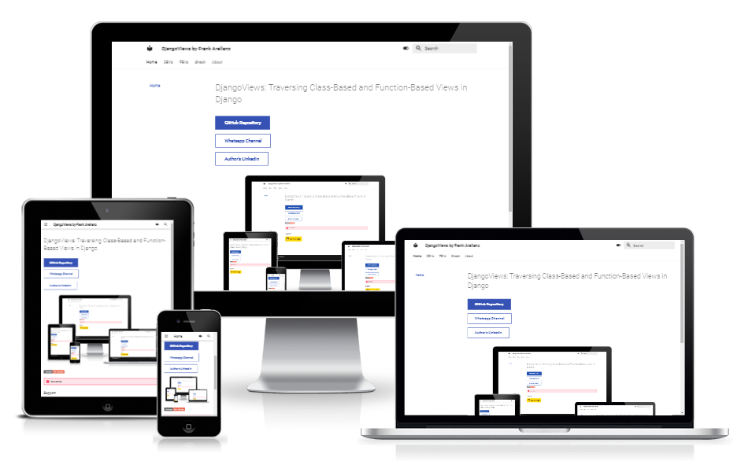

# DjangoViews: Traversing Class-Based and Function-Based Views in Django

I meticulously analyze my own code, with a preference for using OOP through class-based views. However, I'm working as well with function-based views.

The aim of this repository/channel is to foster attention to detail, enhance comprehension, and promote versatility in Python coding, specifically within the Django framework.

To prevent the feeling of being overwhelmed, commonly experienced on other social platforms, I employ progressive disclosure and get straight to the point.

## Full Documentation

## Whatsapp Channel

 

## Credits

- [Django Project](https://www.djangoproject.com/): Django makes it easier to build better web apps more quickly and with less code.
- [Am I Responsive?](https://ui.dev/amiresponsive): for the creation of the mockup images.
- [MkDocs](https://www.mkdocs.org/): used to create the documentation site hosted on Github Pages.
- [MkDocs Material](https://squidfunk.github.io/mkdocs-material/): package to extend MkDocs functionalities and make it more user-centric.
- [STUNNING Code Documentation With MkDocs Material Theme](https://www.youtube.com/watch?v=Q-YA_dA8C20): tutorial to install & manage MkDocs Material by James Willett.
- [Stackoverflow](https://stackoverflow.com/): for in-depth consultation and checking user-created content (from experienced developers) or human opinion.
- [Google](https://google.com): for programming queries.
- [Code Institute](https://codeinstitute.net/): for providing proper education and the [Full Gitpod Template](https://github.com/Code-Institute-Org/gitpod-full-template).
- [ChatGPT](https://chat.openai.com/chat): it was used for the following queries:
    1. Used for general consulting.
    2. Copywriting and proofreading.

## Badges

 

> You cannot reproduce, distribute, or create derivative works from this project.

## Author

- [@plexoio](https://www.github.com/plexoio) | Frank Arellano
